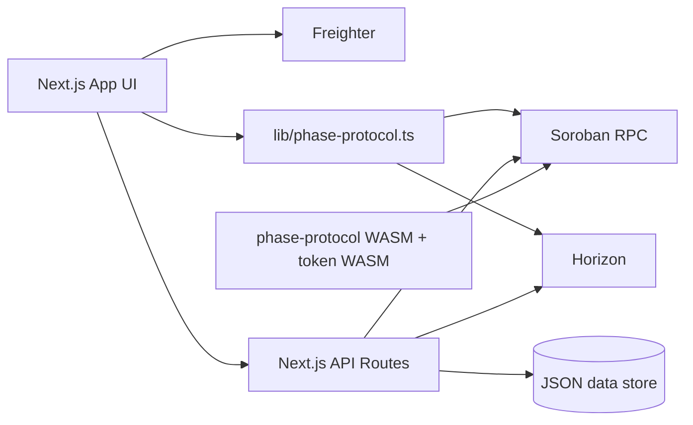

# PHASE Project Architecture

This document defines the architecture baseline for PHASE and is the primary reference for implementation decisions, reviews, and refactors.

## 1) Scope and intent

PHASE is a testnet system composed of:

- **Client application** (Next.js) for forge, dashboard, and chamber UX.
- **API layer** (Next.js route handlers) for reward distribution, trustline relay, x402 support, and profile/listing persistence.
- **On-chain contracts** (Soroban) for protocol state and token interactions.
- **Wallet signing boundary** (Freighter) for user-authorized transactions.

The architecture is designed to keep signing on the client while keeping privileged operations on the server.

## 2) High-level component map

## 3) Runtime boundaries

### 3.1 Client boundary

Owns:

- Wallet connection and signature prompts.
- Interactive state, tactical UI, i18n rendering.
- Read-only on-chain queries (when safe via SDK simulation helpers).

Must not own:

- Admin secrets.
- Issuer secret for classic bootstrap.
- Persistent trusted state decisions.

### 3.2 Server boundary

Owns:

- Reward minting with admin credentials.
- Trustline submit relay endpoint (for signed XDR).
- Persistent JSON data (`faucet claims`, `artist profile`, `listings`) through `lib/server-data-paths.ts`.
- x402 endpoints and payment verification support.

Must not own:

- User private keys.

### 3.3 On-chain boundary

Owns:

- Canonical protocol state (`collection`, `phase`, utility-NFT ownership, settlement effects).
- Token balances and transfer semantics according to deployed contracts.

## 4) Principal user flows

### 4.1 Forge flow

1. User connects wallet.
2. Optional trustline bootstrap is established where applicable.
3. User submits collection metadata and price.
4. Client builds Soroban tx and asks Freighter signature.
5. Tx is sent and confirmed; collection ID is resolved.

### 4.2 Chamber settlement flow

1. Client fetches wallet state and collection price.
2. User executes settlement action.
3. Client signs and submits transaction.
4. On success, chamber refreshes artifact and ownership state.

### 4.3 Rewards flow

1. Client queries `/api/faucet` status.
2. If classic trustline is required, user signs `changeTrust`.
3. Client submits signed trustline to `/api/classic-liq/trustline`.
4. Client calls reward claim endpoint (`/api/faucet` or compatibility route).
5. Server mints reward when conditions are met.

## 5) API architecture principles

- **Typed contracts** for request/response payloads in route handlers.
- **Deterministic status codes** (validation, cooldown, authorization, pending).
- **No implicit success**: all state transitions explicit and auditable.
- **Compatibility routes** allowed if typed and documented.

## 6) Internationalization architecture

- UI strings belong to `lib/phase-copy.ts`.
- Components consume text via `pickCopy(lang)` and must avoid hardcoded user-facing literals.
- New features require EN/ES keys before merge.

## 7) Error-handling architecture

- Domain-level error normalization is required before UI messaging.
- Unauthorized on-chain gate errors (`#13`) map to narrative tactical message:
  - `[ ERROR: BIOMETRIC_TRUST_GATE_CLOSED ]`
- User-facing failures should remain actionable and non-ambiguous.

## 8) Performance architecture (UI)

- Tactical animation classes use GPU compositing hints where flicker/pulse is intentional.
- Keep animations isolated to key controls; avoid broad repaint cascades.
- Prefer CSS primitives and avoid JS-driven animation loops unless required for state logic.

## 9) Security architecture

- Secrets only in server runtime configuration.
- `.env.local` and sensitive keys are never committed.
- Testnet-only assumptions must be explicit in docs and code comments.
- Any privileged operation must validate input shape and origin intent.

## 10) Change-management rules

- Architectural changes require updates to:
  - `PROJECT_ARCHITECTURE.md` (this file)
  - `docs/TECHNICAL.md`
  - relevant API docs
- Contract/address changes require synchronized env and docs updates.
