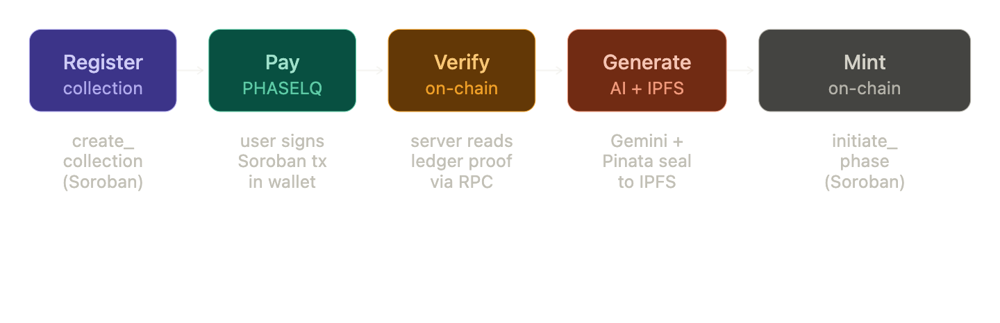
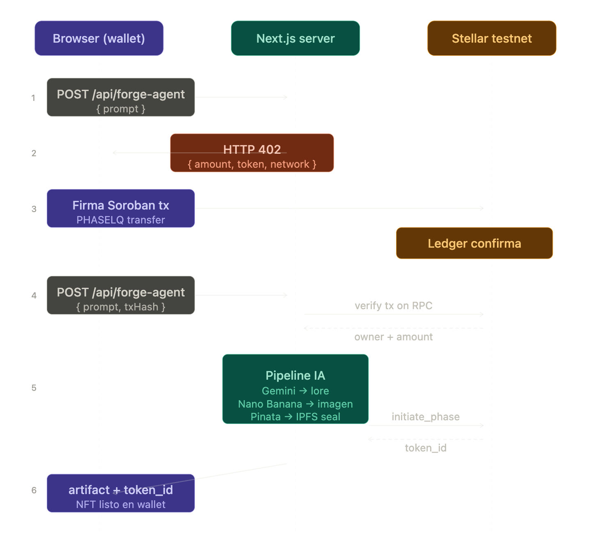
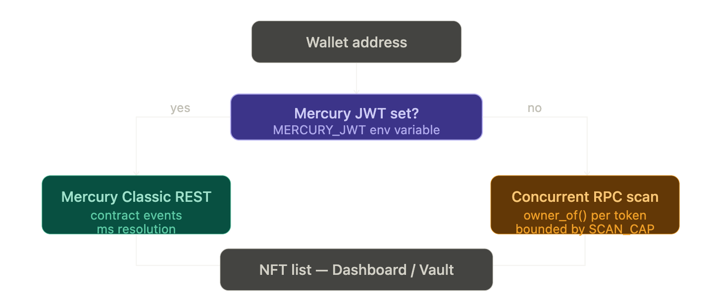

# How PHASE Works

A technical walkthrough of the payment, minting, and ownership model.

---

## The core idea



PHASE enforces a simple rule: **no payment, no artifact**.

Every AI-generated NFT in PHASE is the direct result of a verified on-chain payment. The server never runs the AI pipeline speculatively. It never stores a prompt and generates later. The moment the user submits a prompt, the server responds with a payment demand. Only after the Stellar ledger confirms the transaction does the server run Gemini, generate the image, seal the metadata to IPFS, and mint the token on Soroban.

This is not a paywall bolted onto a generation pipeline. It is a generation pipeline that cannot run without a ledger proof.

---

## x402: what it is and why it matters

HTTP 402 has existed since the early 1990s as a status code meaning "Payment Required." Until x402, no standard defined what that payment should look like or how a server should communicate it to a client.

x402 defines the structure:

- The server returns `402` with a **payment challenge** in the response body and headers
- The challenge specifies: token contract address, amount in stroops, network, and facilitator URL
- The client settles on-chain and receives a transaction hash
- The client re-sends the original request with the settlement proof
- The server (or a facilitator) verifies the proof against the challenge and releases the resource

On Stellar, x402 is a natural fit because Soroban already has atomic, verifiable token transfers. There is no credit card processor, no subscription layer, and no trust in the server's accounting. The ledger is the receipt.

PHASE implements x402 on `stellar:testnet` using the `x402-stellar` library. The facilitator runs at `/api/x402` and is self-hosted — the server validates its own payment challenges using `useFacilitator` from the SDK.

---

## Payment token: PHASELQ

PHASELQ is a Stellar Classic asset with a deployed Stellar Asset Contract (SAC). This makes it:

- **SEP-41 compatible** — callable via Soroban as a standard token (`transfer`, `mint`, `balance`)
- **Classic-visible** — also accessible on Horizon as a regular Stellar asset with trustlines
- **Wallet-ready** — any wallet that supports Stellar assets can hold and display PHASELQ

The SAC is what x402 uses as the payment token. When the user signs the payment transaction, they are calling `transfer` on the PHASELQ SAC contract via Soroban.

---

## The forge flow, step by step



### Step 1 — Connect wallet

The user connects via Stellar Wallets Kit. The kit supports Freighter, Albedo, xBull, and any SEP-7 compatible wallet. The app only reads the public key from the wallet — it never holds the user's private key.

### Step 2 — Trustline setup

PHASELQ is a Classic asset. To receive it, the user's Stellar account must have a trustline for `PHASELQ:ISSUER_ADDRESS`. If the trustline is missing, the Soroban mint will be rejected at the ledger level.

The `/api/classic-liq` endpoint checks trustline status. If missing, `LiquidityFaucetControl` prompts the user to sign a `changeTrust` transaction in their wallet. This is a one-time setup — the trustline persists.

### Step 3 — Bootstrap PHASELQ

New users have no PHASELQ. The `/api/faucet` endpoint distributes a genesis grant on first connection. It can optionally also distribute daily rewards and quest rewards (see the Rewards section). The faucet calls `mint` on the PHASELQ SAC (if `ADMIN_SECRET_KEY` is the issuer) or `transfer` from a distributor wallet (if `FAUCET_DISTRIBUTOR_SECRET_KEY` is set).

### Step 4 — Submit the prompt

`POST /api/forge-agent` with `{ prompt, payerAddress }` and no payment header returns `HTTP 402`:

```json
{
  "protocol": "x402",
  "network": "stellar:testnet",
  "amount": 50000000,
  "token": "C...",
  "facilitator": "https://.../api/x402",
  "invoice": "inv_1712..."
}
```

The client stores this challenge.

### Step 5 — Sign the payment

The Forge page builds a Soroban transaction calling `transfer(user → protocol, amount)` on the PHASELQ SAC. The user signs this in their wallet. The signed XDR is submitted to Soroban RPC.

### Step 6 — Verify and unlock

The second call to `POST /api/forge-agent` includes `{ prompt, settlementTxHash, payerAddress }`. The server:

1. Loads the transaction from RPC using the hash
2. Decodes the Soroban invocation to confirm: correct token contract, correct amount, correct payer
3. Runs `useFacilitator` from `x402-stellar` to validate the payment against the challenge requirements

If verification passes, the AI pipeline runs.

### Step 7 — AI generation

The server calls Google Gemini with the user's prompt to generate lore text (name, description, attributes). It then requests an image from Nano Banana API using a composed prompt that enforces the cyber-brutalist aesthetic. If Nano Banana is unavailable or over quota, the server falls back to Pollinations with equivalent style parameters.

### Step 8 — IPFS seal

The server builds the NFT metadata JSON (SEP-41/50-compatible format) from the Gemini and image outputs. It uploads the JSON to IPFS via Pinata using `PINATA_JWT`. The resulting IPFS CID becomes the canonical metadata URI for the token.

### Step 9 — Soroban mint

With the IPFS URI ready, the server calls the PHASE protocol Soroban contract:

1. `create_collection(creator, price, uri)` — registers the collection if it doesn't exist
2. `initiate_phase(collection_id, minter, ipfs_uri)` — mints the NFT

The contract assigns a sequential `token_id`, records the owner, and emits a ledger event. The resulting token ID is returned to the client.

### Step 10 — Collect to wallet

After minting, the NFT is initially held by the issuer (custodian). The user can collect it to their wallet via the Chamber's `[ COLLECT TO MY WALLET ]` button. This calls `/api/phase-nft/custodian-release`, which submits a server-signed `transfer(issuer → user)` transaction — no additional user signature required.

---

## Chamber: the settlement interface

The Chamber (`/chamber`) is the post-mint interface. Given a `?collection=ID` query parameter, it:

- Reads the collection metadata from the PHASE contract
- Checks if the connected wallet has completed settlement (`get_user_phase`)
- Polls `/api/phase-nft/verify` to confirm on-chain ownership
- Displays the artifact with `PhaseProtectedPreview` — which applies a watermark when the wallet hasn't verified ownership on-chain
- Shows the collect button if the NFT is still in issuer custody
- Runs the LIQ rewards terminal

---

## NFT ownership and the SEP-50 interface

PHASE tokens implement the SEP-50 draft NFT interface on Soroban:

| Function | Signature | Description |
|---|---|---|
| `owner_of` | `(token_id: u32) → Address` | Returns current owner |
| `token_uri` | `(token_id: u32) → String` | Returns IPFS metadata URI |
| `token_metadata` | `(token_id: u32) → Map<String, String>` | Returns on-chain attributes |
| `get_creator_collection_ids` | `(creator: Address) → Vec<u64>` | Returns all collection IDs for creator |
| `get_creator_collection_id` | `(creator: Address) → u32` | Returns first collection ID (backward compat) |
| `get_user_phase` | `(wallet: Address, collection_id: u32) → u32` | Returns token ID minted for wallet |

All `token_id` parameters are `u32` — this is required for Freighter SEP-50 compatibility.

---

## Wallet indexing



When a user opens the Dashboard or Chamber, the app needs to list which NFTs they own. Soroban does not expose a native "tokens owned by address" query. PHASE handles this two ways:

**Mercury Classic** (preferred): If `MERCURY_JWT` is configured, the app queries Mercury's REST API for contract events associated with the wallet. This resolves ownership in milliseconds by querying indexed event history rather than simulating RPC calls.

**RPC fallback**: Without Mercury, the app runs concurrent `owner_of(id)` calls across all token IDs (bounded by `PHASE_EXPLORE_SCAN_CAP`). It uses a concurrency-limited `mapConcurrent` helper to avoid hammering the RPC. This is slower but requires no external dependencies.

Both paths feed the same UI.

---

## Rewards

The `/api/faucet` endpoint manages PHASELQ distribution for new and returning users.

**Genesis reward**: One-time, no requirement. Gives the user enough PHASELQ to forge their first artifact.

**Daily reward**: Available once per 24-hour window. Encourages return visits.

**Quest rewards**: Three one-time completable milestones:
- `quest_connect_wallet` — simply connecting a wallet
- `quest_first_collection` — forging a collection or minting in any existing collection
- `quest_first_settle` — completing a full Chamber settlement (on-chain mint confirmed)

Reward eligibility is evaluated by querying the Soroban contract directly: `get_creator_collection_ids`, `get_user_phase`, and `owner_of` scans. The server does not trust its own records for quest completion — it reads the ledger.

Claims are persisted in a server-side JSON store (`lib/server-data-paths.ts`), which is the only off-chain state in the system. Everything else — ownership, collection registration, settlement history — lives on Soroban.

---

## Explore

`/explore` is a public community gallery that shows all minted PHASE artifacts across all wallets.

`GET /api/explore` scans token IDs from 1 to `total_supply` (capped at `PHASE_EXPLORE_SCAN_CAP`), calls `owner_of` for each in parallel with concurrency limiting, builds metadata for the page slice, and returns paginated results. No wallet connection required.

---

## Security boundaries

**The server never holds user keys.** All signing happens client-side in the user's wallet. The server holds only:
- `ADMIN_SECRET_KEY` or `FAUCET_DISTRIBUTOR_SECRET_KEY` — for faucet payouts
- `PINATA_JWT` — for IPFS uploads
- `GOOGLE_AI_STUDIO_API_KEY` — for Gemini
- The PHASE protocol issuer key (for custodian-release, if applicable)

**The contract is the authority.** Ownership, collection existence, and settlement status are always read from Soroban — not from the server's JSON store. The JSON store only records claim timestamps to prevent double-claiming faucet rewards.

**x402 verification is ledger-proof.** The server does not issue AI output based on user assertions. It decodes the actual Soroban transaction, verifies the invocation arguments, and checks the payer address and amount against the challenge parameters before running any generation.
