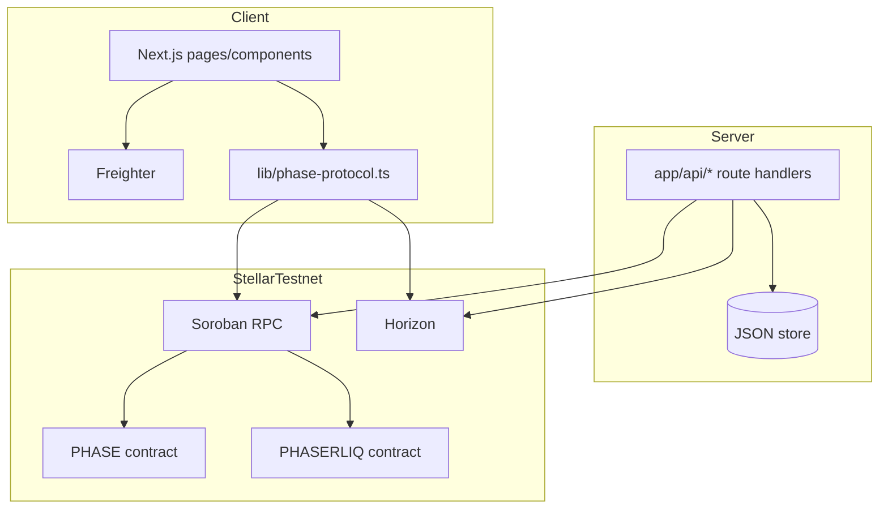

# PHASE Technical Documentation

Professional technical specification for the current repository state.

Primary references:
- [`PROJECT_ARCHITECTURE.md`](../PROJECT_ARCHITECTURE.md)
- [`README.md`](../README.md)
- [`docs/PHASER_LIQ_REWARDS_TERMINAL_DOC.md`](./PHASER_LIQ_REWARDS_TERMINAL_DOC.md)
- [`contracts/README.md`](../contracts/README.md)

---

## 1. System Summary

PHASE is a Next.js + Soroban testnet application where:

- creators register collections;
- users pay PHASERLIQ and mint utility NFTs through settlement;
- rewards/bootstrap APIs support onboarding and testing.

The implementation separates concerns between:

- **Client** (wallet interaction + UI state),
- **Server APIs** (trusted operations and persistence),
- **On-chain contracts** (canonical protocol state).

---

## 2. Runtime Topology



---

## 3. Repository Structure

| Path | Responsibility |
|---|---|
| `app/` | App Router routes, layouts, API handlers, global/tactical styles |
| `components/` | Feature UI components (forge/chamber/rewards/wallet integration) |
| `lib/phase-protocol.ts` | Soroban integration helpers, constants, error normalization |
| `lib/classic-liq.ts` | Classic asset trustline utilities (`changeTrust` XDR, Horizon checks) |
| `lib/phase-copy.ts` | Centralized i18n dictionary (EN/ES) |
| `lib/server-data-paths.ts` | Writable data location abstraction |
| `contracts/` | Soroban Rust contracts and tooling docs |
| `docs/` | Technical and operational documentation |

---

## 4. Frontend Routes

| Route | File | Description |
|---|---|---|
| `/` | `app/page.tsx` | Landing page |
| `/forge` | `app/forge/page.tsx` | Collection creation + Oracle flow + rewards |
| `/dashboard` | `app/dashboard/page.tsx` | Market/catalog/listing operations |
| `/chamber` | `app/chamber/page.tsx` | Settlement and artifact interface |
| `/docs` | `app/docs/page.tsx` | In-app product documentation |
| `/.well-known/stellar.toml` | `app/.well-known/stellar.toml/route.ts` | Dynamic SEP-0001 surface |

---

## 5. API Specification

All handlers live in `app/api/**/route.ts`.

### 5.1 Core routes

| Methods | Route | Purpose |
|---|---|---|
| `GET`, `POST` | `/api/faucet` | Reward status + claim execution (server-minted on success). |
| `POST` | `/api/claim-bounty` | Compatibility wrapper over `/api/faucet` with strict typed contract. |
| `GET`, `POST` | `/api/classic-liq` | Classic PHASERLIQ asset status/bootstrap operations. |
| `POST` | `/api/classic-liq/trustline` | Submits user-signed trustline XDR. |
| `POST` | `/api/forge-agent` | Gemini-first forge assistant endpoint with payment gate support. |
| `GET`, `POST` | `/api/nft-listings` | JSON-backed market listing state. |
| `GET`, `PUT` | `/api/artist-profile` | JSON-backed artist alias profile. |
| `GET`, `POST`, etc. | `/api/x402/*` | x402 settlement/verify/supported endpoints. |

### 5.2 Response contracts

- `forge-agent` and `claim-bounty` now use strict TypeScript response unions.
- Error payloads are explicit and status-code aligned.
- No untyped `any` responses should be used for public API contracts.

---

## 6. On-chain Integration

### 6.1 Contract IDs and validation

`lib/phase-protocol.ts` enforces Soroban contract ID validity (`C...`) and rejects classic account IDs (`G...`) where contracts are expected.

Key constants:

- `CONTRACT_ID` (PHASE protocol contract)
- `TOKEN_ADDRESS` (PHASERLIQ contract)
- `RPC_URL`, `HORIZON_URL`, `NETWORK_PASSPHRASE`

### 6.2 Transaction model

- **Read paths**: simulation + retval parsing.
- **Write paths**: unsigned XDR construction -> Freighter signature -> submit + confirmation polling.
- **Error mapping**: protocol-level normalization (including unauthorized gate `#13`).

---

## 7. Rewards and Trustline Model

The reward flow is trustline-first:

1. Query reward state.
2. Ensure classic trustline exists when required.
3. Claim reward via faucet-compatible endpoint.
4. Refresh balances and UI state.

Detailed operational flow is documented in:
[`docs/PHASER_LIQ_REWARDS_TERMINAL_DOC.md`](./PHASER_LIQ_REWARDS_TERMINAL_DOC.md)

---

## 8. Internationalization Rules

- User-facing strings must come from `lib/phase-copy.ts`.
- Components should not hardcode visible text.
- New feature work must include EN/ES keys before merge.

---

## 9. Environment Variables

Canonical reference remains:
[`/.env.local.example`](../.env.local.example)

Critical groups:

- Protocol/token contract IDs (`NEXT_PUBLIC_*`, server-side variants)
- Reward signer (`ADMIN_SECRET_KEY`)
- Classic asset configuration (`CLASSIC_LIQ_*`, `NEXT_PUBLIC_CLASSIC_*`)
- Gemini runtime (`GEMINI_API_KEY`)
- Writable server data directory (`PHASE_SERVER_DATA_DIR`)

---

## 10. Security and Operations

- Never commit private credentials.
- Keep server-only secrets out of client runtime.
- Use writable server storage abstraction (`server-data-paths`) for platform-safe behavior.
- On contract redeploys, update:
  - env values,
  - architecture/technical docs,
  - any static references.

---

## 11. Build and Verification

```bash
npm install
npm run dev
npm run build
npx tsc --noEmit
```

Contract commands are documented in [`contracts/README.md`](../contracts/README.md).

---

## 12. External References

- [Soroban Smart Contracts](https://developers.stellar.org/docs/build/smart-contracts)
- [SEP-0001](https://github.com/stellar/stellar-protocol/blob/master/ecosystem/sep-0001.md)
- [Freighter Docs](https://docs.freighter.app/)
- [Stellar x402](https://developers.stellar.org/docs/build/agentic-payments/x402)
