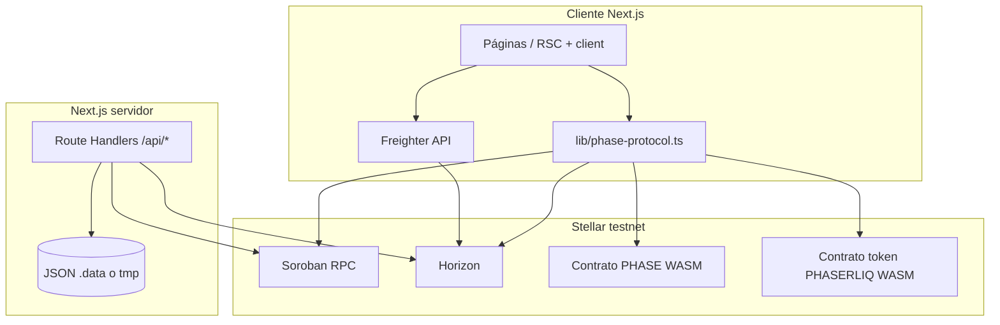

# PHASE — Documentación técnica

Referencia de arquitectura, rutas, APIs, integración Stellar/Soroban y operación. El producto corre en **Stellar testnet** (Soroban + cuentas clásicas G…). No constituye asesoría financiera.

**Índice:** [README](../README.md) · [Contratos Rust](../contracts/README.md) · [Recompensas / faucet](./PHASER_LIQ_REWARDS_TERMINAL_DOC.md) · [Prompt maestro](../PROMPT_MAESTRO_PHASE.md)

---

## 1. Visión del sistema

PHASE es una aplicación **Next.js (App Router)** que permite:

- **Forjar** colecciones on-chain (contrato Soroban PHASE) con nombre, precio de mint en **PHASERLIQ** y URI de imagen.
- **Mercado** (`/dashboard`): catálogo de colecciones y flujos de listado/transferencia de NFT utilitario cuando el contrato expone los entrypoints necesarios.
- **Cámara de fusión** (`/chamber`): el usuario conecta **Freighter**, consulta saldo/token, ejecuta **settlement** (pago + transacción protocolo) y visualiza el artefacto NFT.
- **Recompensas testnet**: mint vía servidor firmado (`/api/faucet`) y, opcionalmente, **activo clásico** PHASERLIQ + trustline (`/api/classic-liq`).
- **Agente de forja** (opcional): lore/imagen vía `POST /api/forge-agent` (Gemini + generación de imagen) con capa de pago x402.

Los identificadores de contrato por defecto y la red están centralizados en [`lib/phase-protocol.ts`](../lib/phase-protocol.ts) y se pueden sobrescribir con variables de entorno `NEXT_PUBLIC_*` / servidor.



---

## 2. Stack tecnológico

| Capa | Tecnología |
|------|------------|
| Framework | Next.js 16 (App Router), React 19 |
| Estilo | Tailwind CSS 4, capa táctica en `app/tactical-command.css` |
| Stellar | `@stellar/stellar-sdk`, `@stellar/freighter-api` |
| Pagos agente | `x402-stellar` (verificación/settlement en rutas API) |
| i18n | `components/lang-context.tsx` + [`lib/phase-copy.ts`](../lib/phase-copy.ts) (EN/ES) |
| UI auxiliar | Radix, sonner, framer-motion, etc. (`package.json`) |

---

## 3. Estructura del repositorio (resumen)

| Ruta | Rol |
|------|-----|
| `app/` | Rutas, layouts, route handlers (`app/api/*`), `globals.css`, `tactical-command.css` |
| `components/` | UI: `fusion-chamber`, `forge` vía página, `liquidity-faucet-control`, `wallet-provider`, etc. |
| `lib/phase-protocol.ts` | Constantes de red, construcción/simulación de llamadas Soroban, utilidades de token |
| `lib/classic-liq.ts` | Activo clásico PHASERLIQ: estado de trustline, XDR `changeTrust` |
| `lib/phase-copy.ts` | Cadenas i18n y tipos de copy |
| `lib/server-data-paths.ts` | Rutas de ficheros JSON persistidos en servidor |
| `contracts/phase-protocol/` | Contrato Soroban en Rust (build/deploy: `contracts/README.md`) |
| `public/` | Estáticos, `og-phase`, iconos, `.well-known/stellar.toml` estático |
| `scripts/` | Utilidades locales (no desplegadas como API) |
| `.data/` | Datos locales gitignored (claims, listados); en Vercel → tmp vía `PHASE_SERVER_DATA_DIR` |

---

## 4. Rutas de interfaz (App Router)

| Ruta | Archivo | Descripción |
|------|---------|-------------|
| `/` | `app/page.tsx` | Landing |
| `/forge` | `app/forge/page.tsx` | Forja: colección, Oracle/agente, estudio, recompensas LIQ |
| `/dashboard` | `app/dashboard/page.tsx` | Mercado / colecciones / listados |
| `/chamber` | `app/chamber/page.tsx` | Cámara: query `?collection=<id>` |
| `/docs` | `app/docs/page.tsx` | Documentación in-app (`lib/project-docs-content.ts`) |
| `/.well-known/stellar.toml` | `app/.well-known/stellar.toml/route.ts` | SEP-0001 dinámico (puede complementar `public/.well-known/stellar.toml`) |

---

## 5. API HTTP (Route Handlers)

Todas bajo `app/api/<name>/route.ts` salvo anidaciones indicadas.

| Método(es) | Ruta | Función |
|------------|------|---------|
| GET, POST | `/api/faucet` | Estado de recompensas por wallet; mint Soroban firmado por cuenta admin (`ADMIN_SECRET_KEY`). Ver [PHASER_LIQ_REWARDS_TERMINAL_DOC.md](./PHASER_LIQ_REWARDS_TERMINAL_DOC.md). |
| GET, POST | `/api/classic-liq` | Configuración activo clásico; GET estado trustline/bootstrap; POST pago bootstrap desde issuer (`CLASSIC_LIQ_ISSUER_SECRET`). |
| POST | `/api/classic-liq/trustline` | Envía a Horizon una transacción **ya firmada** por el usuario (`changeTrust`). Body: `{ signedXdr }`. |
| POST | `/api/ipfs` | Subida servidor a IPFS (Pinata) cuando está configurado. |
| POST | `/api/forge-agent` | Agente forja (Gemini + imagen); integración x402 según implementación actual. |
| GET, POST | `/api/nft-listings` | Listados P2P/demo persistidos en JSON. |
| GET, PUT | `/api/artist-profile` | Perfiles de artista en JSON. |
| GET/POST… | `/api/x402/*` | verify, settle, supported, etc. — compatibilidad con flujo x402 Stellar. |

**Persistencia:** ficheros definidos en `lib/server-data-paths.ts` (`faucet-claims.json`, `classic-liq-claims.json`, `nft-listings.json`, `artist-profiles.json`). El directorio base es `.data/` en local o `PHASE_SERVER_DATA_DIR` / tmp en Vercel.

---

## 6. Integración on-chain (Soroban)

### 6.1 Constantes principales (`lib/phase-protocol.ts`)

- **`CONTRACT_ID`**: contrato PHASE (colecciones, fase, NFT utilitario). Env: `NEXT_PUBLIC_PHASE_PROTOCOL_ID`, `PHASE_PROTOCOL_ID`. Default en código: ver archivo fuente.
- **`TOKEN_ADDRESS`**: contrato del token PHASERLIQ (interfaz tipo SEP-41 en Soroban). Env: `NEXT_PUBLIC_PHASER_TOKEN_ID`, `NEXT_PUBLIC_TOKEN_CONTRACT_ID`, `TOKEN_CONTRACT_ID`, `MOCK_TOKEN_ID`, etc.
- **`RPC_URL`**: `https://soroban-testnet.stellar.org`
- **`HORIZON_URL`**: `https://horizon-testnet.stellar.org` (secuencia de cuentas G…, balances clásicos)
- **`NETWORK_PASSPHRASE`**: `Test SDF Network ; September 2015`
- **`PHASER_LIQ_DECIMALS`**: `7` — conversiones humano ↔ stroops en helpers (`formatLiq`, `stroopsToLiqDisplay`, `liqToStroops`, …)
- **`READONLY_SIM_SOURCE_G`**: cuenta G con XLM en testnet usada como *fee account* en simulaciones de solo lectura (override `NEXT_PUBLIC_SOROBAN_SIM_ACCOUNT`)

### 6.2 Patrones de uso

- **Lectura**: muchas funciones construyen una transacción de invocación, la **simulan** vía RPC y parsean el retval (`simulateContractCall`).
- **Escritura**: el cliente obtiene XDR o envelope, el usuario firma con **Freighter** (`signTransaction`), y se envía con `sendTransaction` / RPC según el flujo.

Las funciones exportadas incluyen (no exhaustivo): `buildSettleTransaction`, `buildCreateCollectionTransaction`, `getTokenBalance`, `checkHasPhased`, `fetchCollectionInfo`, `fetchCollectionsCatalog`, `sendTransaction`, `getTransactionResult`, etc.

---

## 7. Activo clásico PHASERLIQ y SEP-0001

- El token mostrado en **Freighter** como línea de balance clásica requiere **trustline** (`changeTrust`) hacia el **issuer** G… y código `PHASERLIQ` (u otro configurado).
- Variables servidor: `CLASSIC_LIQ_ASSET_CODE`, `CLASSIC_LIQ_ISSUER_SECRET`, `CLASSIC_LIQ_BOOTSTRAP_AMOUNT`.
- Variables públicas UI: `NEXT_PUBLIC_CLASSIC_LIQ_ASSET_CODE`, `NEXT_PUBLIC_CLASSIC_LIQ_ISSUER` (cuando se use en cliente; el flujo de recompensas puede obtener `asset` desde `GET /api/classic-liq`).

**Trustline antes del faucet:** `components/liquidity-faucet-control.tsx` llama a `GET /api/classic-liq` antes de `POST /api/faucet`. Si el servidor tiene activo clásico habilitado y la wallet no tiene trustline, se construye y firma `changeTrust` y se envía a `/api/classic-liq/trustline`.

**SEP-0001:** Metadatos del emisor para exploradores/wallets: `/.well-known/stellar.toml` (estático en `public/` y/o ruta dinámica en `app/.well-known/`). El **home domain** de la cuenta emisora en la red debe coincidir con el dominio que sirve el TOML.

---

## 8. Wallet y sesión

- **`components/wallet-provider.tsx`**: contexto React; lectura de dirección Freighter, `connect` / `disconnect`, refresco. Maneja edge cases (desconexión explícita vs. permiso persistente de Freighter).
- Las páginas críticas (`/forge`, `/chamber`) son **client components** donde corresponde para firmar transacciones.

---

## 9. Flujo de settlement (cámara)

Resumen del flujo de negocio en UI (simplificado):

1. Usuario conecta wallet y se muestra saldo PHASERLIQ (Soroban) vía contrato token.
2. Se muestra precio de mint de la colección (`effectivePriceStroops`).
3. Al ejecutar settlement, la app construye la transacción (p. ej. `buildSettleTransaction`), el usuario firma en Freighter y se envía a la red.
4. Tras confirmación, se refresca estado de fase / NFT y el visualizador de artefacto.

Los textos de error (desync Stellar, saldo insuficiente) se mapean en `fusion-chamber.tsx` y copy en `phase-copy`.

---

## 10. x402

- Dependencia **`x402-stellar`** y rutas bajo `app/api/x402/` para verificación y settlement acorde al ecosistema Stellar x402.
- El agente de forja puede exigir pago x402 antes de generar contenido; revisar `app/api/forge-agent/route.ts` para reglas actuales y cabeceras.

---

## 11. Variables de entorno

Lista orientativa; la fuente de verdad comentada está en [`.env.local.example`](../.env.local.example).

| Variable | Ámbito | Uso |
|----------|--------|-----|
| `NEXT_PUBLIC_PHASE_PROTOCOL_ID` | Cliente | ID contrato PHASE |
| `NEXT_PUBLIC_PHASER_TOKEN_ID` / `NEXT_PUBLIC_TOKEN_CONTRACT_ID` | Cliente | ID contrato token |
| `ADMIN_SECRET_KEY` | Servidor | Firma mints faucet Soroban |
| `CLASSIC_LIQ_*` / `NEXT_PUBLIC_CLASSIC_*` | Servidor / cliente | Activo clásico + trustline UX |
| `PINATA_JWT` / APIs IPFS | Servidor | Subida de archivos en forja |
| `GEMINI_API_KEY` | Servidor | Agente forja (si no hay clave, el endpoint puede responder no disponible) |
| `NEXT_PUBLIC_SITE_URL` | Cliente | URLs absolutas OG/metadata |
| `PHASE_SERVER_DATA_DIR` | Servidor | Directorio escribible para JSON |

**Nunca** commitear `.env.local` ni secretos.

---

## 12. Seguridad y operaciones

- Claves solo en entorno servidor; rotar si se filtran.
- Testnet: los fondos no son dinero real; igualmente minimizar exposición de issuer/faucet.
- Tras redesplegar WASM PHASE o token, actualizar env y documentación (`README`, este archivo).
- CORS y cabeceras: revisar `next.config.mjs` para orígenes permitidos en rutas sensibles.

---

## 13. Comandos locales

```bash
npm install
cp .env.local.example .env.local
npm run dev    # desarrollo
npm run build  # producción
npm run start  # sirve build
```

Contrato Rust: ver [`contracts/README.md`](../contracts/README.md) (`cargo build`, `stellar contract deploy`, etc.).

---

## 14. Referencias externas

- [Stellar Soroban](https://developers.stellar.org/docs/build/smart-contracts)
- [SEP-0001](https://github.com/stellar/stellar-protocol/blob/master/ecosystem/sep-0001.md)
- [Freighter](https://docs.freighter.app/)
- [Stellar x402](https://developers.stellar.org/docs/build/agentic-payments/x402)

---

*Última revisión alineada con el árbol de código del repositorio; si alguna ruta o env difiere en tu fork, prioriza el código fuente.*
